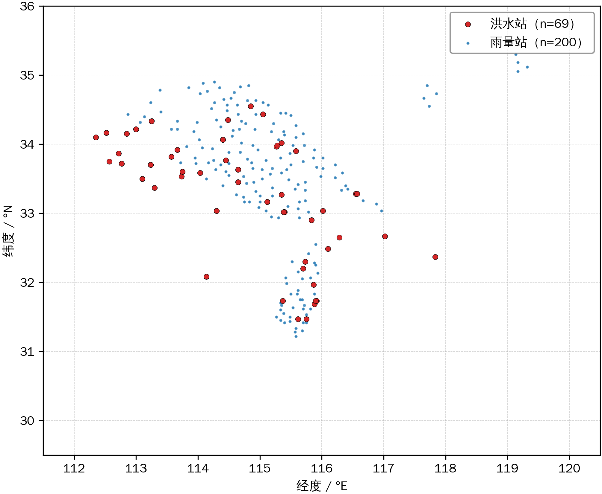
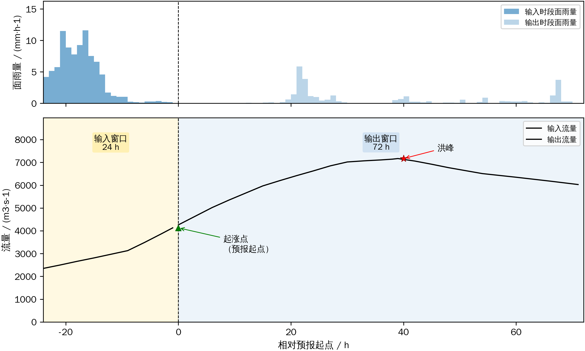
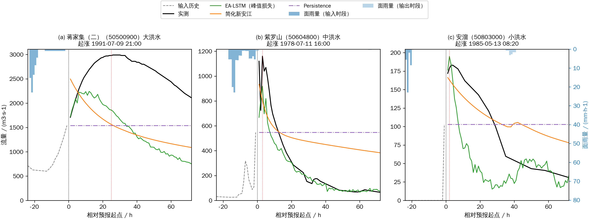
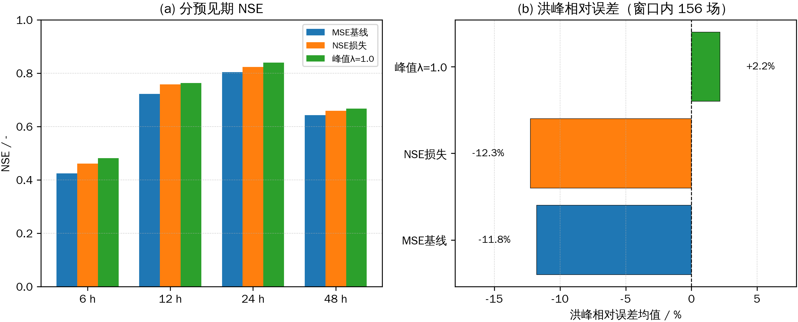
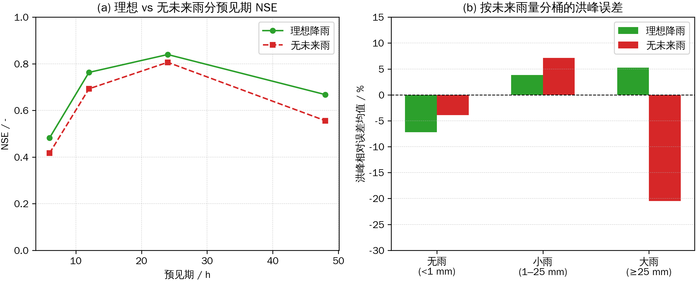
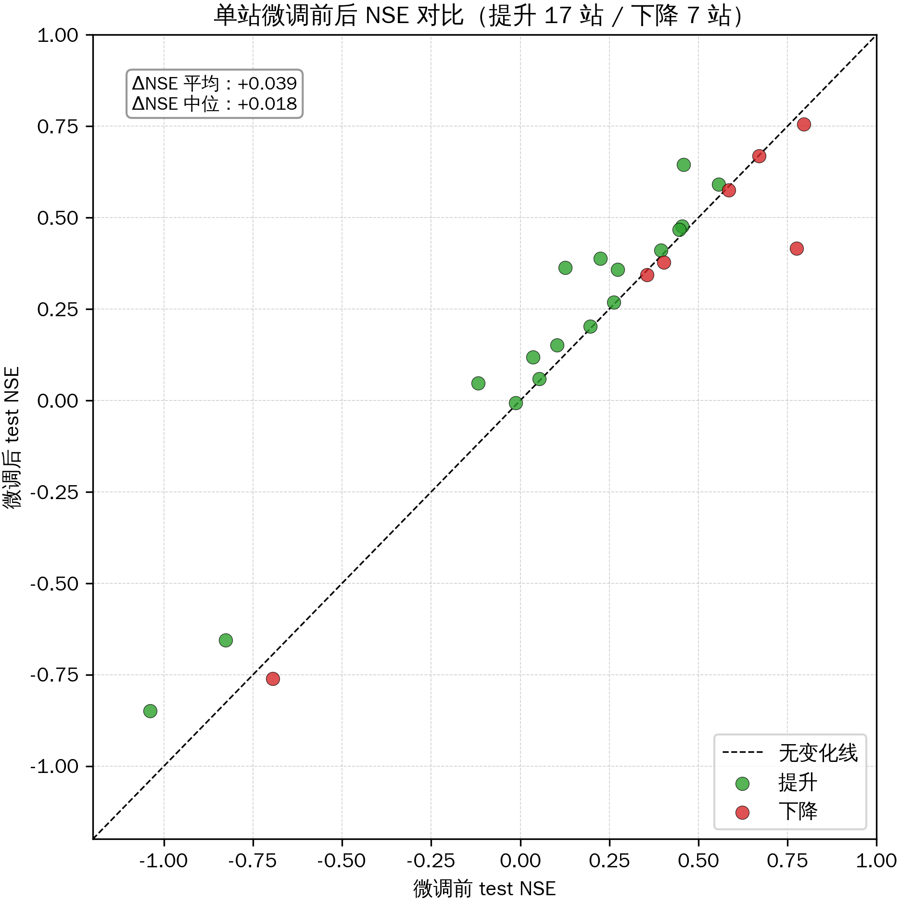

# 面向不规则摘录资料的事件级多站洪水预报：静态属性条件化 LSTM 与峰值导向损失——以淮河流域沙颍河、史河水系为例

（作者信息：略）

---

## 摘要

淮河流域水文年鉴中的逐小时摘录数据有一个鲜明特点：洪水期加密到 1～6 h，平水期则很稀疏，甚至不采样。这种不规则时间序列无法直接套用 CAMELS 式的连续滑动窗口范式，却天然适合以"场"为单位建模。

本文从 84 个水文站（集中分布于沙颍河、史河流域）1950—2024 年逐小时摘录中提取了 1091 场洪水事件，以起涨点为预报起点，构建"输入 24 h、输出 72 h"的逐时样本；建立静态属性条件化的多站联合 LSTM 模型，并与 Persistence、站点无关 LSTM、SCS-CN+Nash、简化新安江模型在同一切分、同一指标口径下做基线比较。针对 MSE 损失造成的洪峰系统性低估，提出峰值导向损失（MSE 与 softmax 加权最大值差之和，λ=1.0）。

测试集 160 场事件上，静态属性条件化 LSTM 联合模型 NSE 为 0.727，优于站点无关 LSTM（0.684）、Persistence（0.578）和两类概念模型中表现较好的简化新安江（0.642）。引入峰值导向损失后 NSE 升至 0.752，洪峰相对误差由 −11.8% 修正至 +2.1%，系统性低估基本消除。未来降雨信息消融试验显示：理想降雨设定（解码端使用未来实测降雨）是可预报性上限，去除未来降雨信息后 NSE 降至 0.681，降雨信息的价值集中在大雨事件（洪峰误差差 25.8 个百分点）。5 个随机种子重复训练给出 test NSE 0.737±0.020、超阈值 F1 0.604±0.037 的噪声带，原单次结果落在带内偏上；按年 5 折交叉验证进一步表明训练对数据重采样鲁棒（val ±0.073、test ±0.004）。多站预训练加单站微调使 17/24 站受益（ΔNSE 平均 +0.039）。

**关键词**：洪水预报；事件级建模；静态属性条件化 LSTM；峰值导向损失；洪峰低估；淮河流域

---

## 1 引言

洪水预报是防洪减灾非工程措施的核心环节。我国现行洪水预报业务以新安江模型[1-2]、SCS-CN[3] 等概念性水文模型为主体。这类"产流—汇流"两段式模型参数物理意义明确、对资料要求相对较低，至今仍是各级水情部门的主力工具。但概念性模型存在固有局限：逐流域率定依赖长序列历史资料，无资料与少资料地区（PUB 问题）区域化迁移困难[4]；产汇流结构系人为假定，非线性表达能力有限，大洪水及超历史事件下可靠性下降；单流域独立建模难以利用站群信息，实时校正多依赖人工经验。

近十年来，以 LSTM[5] 为代表的深度学习方法在降雨-径流建模中取得系统性突破。Kratzert 等[6]在 CAMELS 美国 241 个流域上表明，区域联合训练的 LSTM 可达到并超过逐站率定的概念模型；其后在 531 个流域上证实"大样本联合训练优于单站率定"，并提出以静态属性条件化网络行为的 EA-LSTM，使网络能够区分不同流域的动态行为[7-8]。在小时尺度上，单一 LSTM 的峰现时间误差中位数约 3.5 h，优于美国国家水模型[9]。Nearing 等[10]进一步将这一范式推广至全球尺度，其 encoder-decoder 双 LSTM 模型在无资料流域的洪水预报精度可与有资料区率定的业务模型相当，被视作洪水预报深度学习的代表性成果。Frame 等[11]则表明 LSTM 对训练中未见过的极端洪峰事件仍保持优势；LSTM 亦被用作美国国家水模型等物理模型的后处理器[12]，并通过数据同化或自回归方式利用近实时观测以提升短期预报[13]。

上述进展大多建立在 CAMELS 式的连续等间隔长序列数据上。我国大量历史水文资料以水文年鉴"逐小时摘录"形式保存：洪水期加密到 1～6 h 一条，平水期仅有定时观测甚至不采样，时间间隔不规则。这类数据无法直接套用"连续序列滑动窗口"范式，却天然契合以"场"为单位的洪水预报。Le 等[14]曾在越南流域以事件级 LSTM 开展 1～3 d 预见期洪水预报，验证了这一范式的可行性；Hu 等[15]也在我国典型流域检验了 LSTM 降雨-径流模拟能力。与此同时，深度学习洪水预报普遍存在的洪峰系统性低估问题[10-11]尚缺乏简洁有效的确定性解决方案；而多数研究的评估建立在"起报时刻已知未来降雨"的理想设定上，其业务含义需要通过去除未来降雨信息的对照实验加以厘清。

本文以淮河流域 84 个水文站 1950—2024 年逐小时摘录与 205 个雨量站次降雨资料为基础，开展事件级洪水预报研究。主要工作与贡献如下：

1. **事件级建模范式**：针对摘录数据的时间不规则性，建立"POT 事件提取—起涨点起报—事件整组按年切分"的样本构建流程，将 1091 场历史洪水组织为可供深度学习直接训练的事件样本库，与 CAMELS 连续序列范式形成对照；
2. **峰值导向损失**：提出 MSE 与 softmax 加权最大值差相叠加的峰值导向损失（λ=1.0），在不牺牲整体 NSE 的前提下将静态属性条件化 LSTM 的洪峰系统性低估由 −11.8% 修正至 +2.1%；
3. **统一测试集下的基线比较**：在同一测试集（160 场事件）、同一理想降雨信息条件、同一指标体系下，对 Persistence、站点无关 LSTM、静态属性条件化 LSTM 与两类概念模型（SCS-CN+Nash、简化新安江）进行基线比较；各方法输入信息集存在结构性差异，比较结果按信息条件差异作相应解读（见 4.1 与 5(4) 节）；
4. **未来降雨信息消融试验**：通过去除或替换未来降雨信息的对照实验量化降雨信息价值与无未来降雨条件下的预报水平，通过按年 5 折交叉验证标定指标的噪声带，并检验多站预训练加单站微调的迁移收益。

## 2 数据与事件样本构建

### 2.1 研究区与数据概况

淮河流域地处我国东部，介于长江、黄河两大流域之间，流域面积约 27 万 km²，跨河南、安徽、江苏、山东四省。流域处于暖温带与北亚热带气候过渡带，多年平均降水量约 900 mm，年内分配高度集中，汛期（6—9 月）降水量约占全年六成以上；暴雨主要受梅雨锋与台风影响，常出现大范围持续性暴雨。水系结构上，淮河上游为山丘区，坡陡流急、洪水陡涨陡落；中下游进入平原，河道比降平缓、行洪能力有限，加之河湖洼地众多，洪水持续时间长、调度难度大。山区型与平原型洪水并存，使流域内不同站点的洪水过程形态差异显著。历史上"75·8"特大洪水、2003/2007/2020 年流域性大洪水均造成重大损失，洪水预报需求突出。

需要说明的是，受逐小时摘录资料保存范围所限，本文站点并非均匀覆盖全流域，而是集中分布于**沙颍河流域与史河流域**：84 个水文站中沙颍河流域 55 站（含 12 站按站号段推断）、史河流域 9 站、涡河流域 9 站，其余 13 站分散于淮河干流、洪汝河等；205 个雨量站中沙颍河流域 92 站、史河流域 37 站、涡河流域 59 站。35 个建模站的构成同样如此——沙颍河流域 17 站、史河流域 8 站、涡河流域 5 站。因此本文结论更确切地说是面向沙颍河、史河等淮河上游支流流域的，各站资料年限差异大（277 条至 29839 条记录），覆盖山丘区与平原区、不同量级河流，对该区域洪水类型具有较好代表性。全部站点的名称、经纬度、类型与所属流域见附表（站点清单）。

本研究使用的基础数据来自淮河流域水文数据库：

- **逐小时摘录**：84 个水文站、35.0 万条记录（1950—2024 年），含水位、流量。这是典型的水文年鉴式摘录——全库中相邻记录间隔 ≤6 h 的占 70%，>10 d 的间隔仅 3551 处，呈"洪水期加密（1～6 h）、平水期稀疏或不采样"形态；
- **次降雨**：205 个雨量站、150.8 万条次降雨记录（起止时段及降雨量，mm）；
- **站点元数据**：站点注册表（经纬度、高程、资料年限等），其中 6/35 个建模站高程缺失。

与 CAMELS 等公开数据集[7]的连续日/小时序列不同，本数据的事件性、非等间隔特征决定了建模范式必须以"场"为基本单位。

### 2.2 洪水事件提取

采用 POT（超定量）法[16]逐站提取洪水事件。步骤为：① 信号选择——流量非空记录 ≥100 条的站用流量（75 站），否则用水位（9 站）；② 在相邻记录间隔 >10 d 处切段；③ 以该站信号全序列的 95% 分位数为阈值，段内连续超阈部分为候选事件，峰现时间取段内最大值处；④ 峰现间隔 <3 d 的相邻候选合并为一场（处理复峰）；⑤ 剔除峰值 ≤0、历时 <1 h 或记录 <2 条的候选。

共提取洪水事件 **1091 场，覆盖全部 84 站**。各站事件数差异大（中位数 4 场、均值 13.0 场、最大 64 场），源于各站资料年限与摘录密度差异。全流域最大洪峰为"75·8"板桥站（1975-08-08，12100 m³/s），2003、2007、2020 年大水事件均被正确捕获，验证了提取的合理性。年代分布上 1950s—2000s 各年代 117～223 场，2010s 起降至 58 场，主要因摘录数据近年覆盖变薄而非洪水减少。

### 2.3 雨量站匹配与面雨量

对每个水文站匹配距离 100 km 内、资料期重叠的雨量站（按距离排序取最近 ≤8 个）；次降雨按与 1 h 时段的重叠时长比例均摊到逐时，再以 1/d² 反距离加权[17]合成面雨量过程。窗口内完全无降雨数据的事件保留并标记 rain_missing（122 场，占 12.8%，其中 4 站无任何雨量站匹配）。

### 2.4 事件级样本构建

选择信号为流量且事件数 ≥5 的 35 个站进入建模（候选 989 场）。每场事件构建一个样本：

- **预报起点取起涨点**，起涨点定义为事件 start_time，即 2.2 节场次划分确定的事件起始时刻。需指出，这意味着预报对象是已识别洪水事件的发展过程，属于已知洪水事件条件下的过程预报，不含事件识别与起报触发环节。曾以洪峰时刻为起点的试验表明该设定下输出以退水段为主、峰现时间指标失真，故预报起点固定为起涨点；
- **输入**：起涨点前 24 h 逐时 5 维特征——面雨量、流量、水位（缺测填 0）、水位观测掩码、流量观测掩码。不规则摘录线性内插到 1 h 网格，观测掩码取该时刻 ±3 h 内有无原始记录；窗口内原始观测 <10 个的事件丢弃（38 场）；
- **输出**：起涨点后 72 h 逐时流量。依据是流量事件洪峰滞后起涨时间的 p95 为 58 h，72 h 窗口覆盖约 96% 事件的洪峰；**25 场（2.6%）洪峰落在窗口外**，峰值指标以窗口内 156 场子集为主口径并说明截断影响；
- **归一化**：流量/水位按站 z-score，均值方差仅用训练年份记录估计；雨量全局除以训练样本逐时面雨量 95 分位数（4.031 mm/h）。

最终构建样本 **951 场**。**切分按事件洪峰所在年份整组进行**（年代分层随机，种子 42），同一年的多场洪水不跨集合，防止同一雨季泄漏；训练年份末尾约 15% 切出作早停验证集。结果为：train 743 场（45 年，35 站）、val 48 场（8 年，17 站）、test 160 场（14 年，25 站），测试年份含 1991、2002、2016 等大洪水年。

全文术语约定：train/val/test 分别指训练集、早停验证集与测试集；mean 表示均值、median 表示中位数、abs 表示绝对值；分位数以后缀 p 表示（如 p95 为 95% 分位数）；epoch 指训练轮次；decoder 指解码器；offset 指滚动预报中预报起点相对起涨点的时移（h）。

## 3 方法

### 3.1 静态属性条件化 LSTM 多站联合模型

主体模型为事件级静态属性条件化 LSTM，由三部分组成：

1. **静态属性嵌入**：取站点注册表的经度、纬度、高程、资料年限、训练年流量均值与标准差（对数化）、高程缺失标记共 7 维静态属性（按训练站均值方差标准化，高程缺失填训练站均值），经嵌入网络生成站点嵌入向量 $\boldsymbol{s}$（16 维）。这一设计借鉴 EA-LSTM 以静态属性条件化网络行为的思想[8]，但实现方式不同：经典 EA-LSTM 将静态属性输入专门的静态门控单元，本文仅将站点嵌入与逐时输入特征拼接后送入 LSTM（输入端条件化），故本文模型称为静态属性条件化 LSTM。该设计使共享网络能区分不同量级、不同响应特性的站点；
2. **时序编码器**：双层 LSTM（隐层 128，dropout 0.2），读取 24 h×5 输入特征与站点嵌入的拼接序列，输出末时刻隐状态；
3. **线性多步预测头**：将编码器末隐状态、站点嵌入与**未来 72 h 面雨量（拉平）**拼接，经全连接网络**一次输出 72 步**流量预测。

需强调的信息条件设定：预测头使用的未来 72 h 面雨量为**实测降雨**，即理想降雨设定（ideal rainfall），所得指标应理解为可预报性上限（potential predictability），不代表业务可用预见期；无未来降雨条件下的预报水平通过第 4.3 节的消融试验单独量化。

### 3.2 峰值导向损失

洪水预报的核心业务指标是洪峰量级，而以平方误差为主体的 MSE 损失对尖峰具有平滑效应，导致深度学习模型系统性低估洪峰。前期的指示函数加权尝试（超阈时步权重 3 倍）因超阈步占比小、梯度被少数峰值步主导且与早停准则错位而失败（见 4.2 节）。

为此提出峰值导向损失：在 MSE 上叠加一项输出窗口内最大流量的可微近似之差。

$$
w_t = \mathrm{softmax}\left(\hat{q}_t/\tau\right),\qquad
\hat{q}_{\max} = \sum_{t=1}^{T} w_t \hat{q}_t,\qquad
q_{\max} = \sum_{t=1}^{T} \mathrm{softmax}(q_t/\tau)\, q_t
$$

$$
\mathcal{L} = \mathrm{MSE}(\hat{\boldsymbol{q}}, \boldsymbol{q}) + \lambda\, \left| \hat{q}_{\max} - q_{\max} \right|
$$

其中 $\hat{q}_t$、$q_t$ 为归一化空间（按站 z-score）的预测与实测流量。$\hat{q}_{\max}$、$q_{\max}$ 逐样本计算，MSE 项与峰值项均按 batch 取均值（reduction=mean）后叠加。温度 $\tau$ 固定取 1.0，选取依据为：归一化空间中峰区 z 值（约 3～10）与基流 z 值（约 −0.3）相差悬殊，$\tau=1.0$ 时 softmax 权重已集中于峰值时刻、接近 hard max，同时保持全域可微、梯度平滑；$\tau$ 过小会使权重过度集中于单点、梯度不稳，过大则峰值约束被稀释。峰值项每场事件只提供一个标量约束，既覆盖所有事件（不限于超阈时步），又不与 val MSE 早停准则冲突。$\lambda$ 通过在 {0.5, 1.0} 上的对比试验选定：$\lambda=0.5$ 时峰值项梯度相对 MSE 项偏弱、修正不足；$\lambda=1.0$ 时两项梯度量级相当、峰值修正充分且整体指标不降，故取 $\lambda=1.0$（对比结果见 4.2 节）。

### 3.3 对照方法

在同一测试集、同一理想降雨信息条件、同一指标口径下设置五组对照。需说明各方法输入信息集并不完全对等：深度学习方法使用起点前 24 h 完整轨迹，概念模型仅自起点流量单点出发（见 4.1 节解读边界）。

- **Persistence（持续性预报）**：输出 72 h = 输入最后时刻流量（起涨点流量外推）；
- **站点无关 LSTM**：encoder-decoder LSTM（encoder 读 24 h×5 输入，decoder 逐步输出 72 h，每步输入为上一步流量与该步未来面雨量，teacher forcing 0.5），全部站事件池化训练、无站点身份输入；
- **LSTM+峰值加权损失**：结构同上，损失改为加权 MSE（超该站训练年 p90 阈值时步权重 3 倍）；
- **SCS-CN[3]+Nash[18]**：SCS 曲线数法产流（CN 按前期影响雨量 API 在三种前期湿润等级间切换）+ Nash 瞬时单位线汇流，4 参数；
- **简化新安江模型[1-2]**：蓄水容量曲线产流（忽略蒸散发）+ 自由水蓄水库三水源划分（地表径流直达出口），6 参数。

两概念模型共同约定：站点注册表无流域面积，面积作为"有效面积"参数率定；基流自起点实测流量按 0.995/h 退水；初始土壤含水量由起点前 24 h 降雨按 API 指数衰减（日衰减 0.85）估计；起点后输入实测降雨（与深度学习方法信息条件一致）。概念模型在每个测试站的 train+val 年份事件上以"平均事件 NSE 最大"为目标用差分进化算法率定，23/25 站完成分站率定，2 站因事件不足（<5 场）采用成功站参数中位数。

深度学习模型训练统一为：Adam（lr=1e-3）、batch 64、epoch ≤100、val MSE 早停（patience=10）、种子 42、单卡 CUDA。

### 3.4 评价指标

在反归一化（m³/s）空间计算以下指标，所有指标分预见期报告：

- **纳什效率系数（NSE）**，全过程所有网格点池化计算：

$$
\mathrm{NSE} = 1 - \frac{\sum_{i,t}\left(y_{i,t}-\hat{y}_{i,t}\right)^2}{\sum_{i,t}\left(y_{i,t}-\bar{y}\right)^2}
$$

- **洪峰相对误差**：$\mathrm{PE} = (\hat{Q}_p - Q_p)/Q_p$，$\hat{Q}_p$、$Q_p$ 为输出窗口内预测与实测峰值，以窗口内 156 场子集为主口径；
- **峰现时间误差**：$\mathrm{TE} = \hat{t}_p - t_p$（h，负值表示预测峰偏早），报告均值与绝对值中位数；
- **超阈值事件 F1**：阈值为该站训练年流量 p95，连续超限簇按簇内峰值时刻计为一个事件，预测与实测事件峰值时刻 ±12 h 内匹配计为命中，由此计算 precision、recall 与 F1。该口径参照 Nearing 等[10]的事件检出思想，但因摘录稀疏无法可靠估计重现期，阈值改用训练年 p95、匹配窗口改为 ±12 h。

## 4 结果与分析

### 4.1 六种方法主对比

表 1 给出六种方法在 test 160 场事件上的对比。各方法输入信息集存在结构性差异——深度学习方法使用起点前 24 h 完整轨迹与未来 72 h 降雨，概念模型仅自起点流量单点出发、使用起点后降雨——故表 1 应理解为统一测试集、统一指标口径下的基线比较，而非信息条件严格对等的能力对比。表中"联合+峰值损失"列为引入 4.2 节峰值导向损失（λ=1.0）后的最终模型。

**表1 六种方法测试集指标对比**

| 指标 | Persistence | LSTM | 条件化LSTM联合 | 联合+峰值损失 | SCS-CN+Nash | 简化新安江 |
|---|---:|---:|---:|---:|---:|---:|
| NSE（全部网格点） | 0.578 | 0.684 | 0.727 | **0.752** | 0.612 | 0.642 |
| NSE（仅观测点） | 0.578 | 0.675 | **0.713** | — | 0.602 | 0.634 |
| RMSE 全过程（m³/s） | 639.79 | 554.04 | 514.61 | **490.2** | 613.48 | 589.27 |
| NSE 6h | 0.246 | 0.425 | 0.425 | **0.482** | 0.269 | 0.304 |
| NSE 12h | 0.601 | 0.687 | 0.722 | **0.763** | 0.651 | 0.660 |
| NSE 24h | 0.702 | 0.766 | 0.804 | **0.840** | 0.686 | 0.741 |
| NSE 48h | 0.453 | 0.613 | 0.643 | **0.668** | 0.509 | 0.538 |
| 洪峰相对误差 mean/median | −0.514/−0.484 | −0.146/−0.134 | −0.118/−0.102 | **+0.021/−0.018** | −0.438/−0.418 | −0.189/−0.234 |
| 峰现时间误差 mean（h） | −10.90 | **−2.00** | −4.49 | — | +1.89 | −9.17 |
| 峰现时间误差 abs 中位（h） | 4.0 | 3.0 | **2.0** | **2.0** | 4.5 | 4.0 |
| 超阈值事件 F1 | 0.235 | **0.759** | 0.650 | 0.691 | 0.378 | 0.582 |

> 注：峰值/峰现指标为输出窗口内洪峰未截断的 156 场子集；其余指标基于全部 160 场事件计算。"—"表示该口径未单独计算。

主要结论如下：

1. **静态属性条件化 LSTM 多站联合综合表现最好**：NSE 0.727，较站点无关 LSTM（0.684）提高 0.043，12/24/48 h 预见期全面领先（24 h NSE 0.804 vs 0.766），洪峰低估最小（−11.8%），峰现时间误差绝对中位 2 h；叠加峰值导向损失后 NSE 进一步升至 0.752，各分预见期指标均有改善。该口径与 Kratzert 等[9]的峰前起报口径同义，其结果（中位约 3.5 h）与本文 2～3 h 相当，但需注意其为连续模拟、本文为事件窗口加理想降雨。静态属性条件化使共享网络能够区分不同量级与响应特性的站点，表明"大样本联合训练优于站点无关池化"的结论[7]在事件级数据上依然成立；
2. **深度学习相对概念模型的优势明确但有限度**：两类概念模型中表现较好的简化新安江 NSE 0.642，超过 Persistence（0.578）、接近站点无关 LSTM（0.684）；静态属性条件化 LSTM 在此基础上再提高 0.085，且差距随预见期扩大（48 h 预见期 +0.105）。深度学习的优势集中于峰现时间（abs 中位 2 h vs 4 h）、洪峰量级（−11.8% vs −18.9%）与长预见期，其核心来源是 24 h 流量轨迹中的动量与形态信息——事件起点常含前次洪水退水段，概念模型则只能自起点流量单点出发、依赖起点后降雨驱动产流。逐事件口径下，概念模型在基流占比低、降雨-涨水关系可靠的 3 个站反超静态属性条件化 LSTM，显示其"少犯错"的稳健性。仅起点流量的最小信息基线消融试验进一步定量了上述信息差：把历史输入压缩为与概念模型相同的起点流量单点 q0 后，q0-MLP（无未来降雨）NSE 已达 0.611，超过 Persistence（0.578）、逼近简化新安江（0.642），说明起点流量与事件统计形态学习本身即蕴含可观信息；但完整模型在其上仍有约 +0.14 的 NSE 增量（24/48 h 预见期差距 0.12/0.21），且同样使用理想未来降雨的弱结构（q0+雨 LSTM）仅得 NSE 0.472、反而不及不用未来雨的 q0-MLP——信息的价值依赖于提取它的结构，24 h 轨迹、静态属性条件化与网络容量的组合贡献不可归因于"是否用了 24 h 历史输入"这一单一变量。这正说明表 1 的定位是基线比较而非信息条件严格对等的能力对比；
3. **所有方法系统性低估洪峰**（−12%～−19%，SCS-CN 与 Persistence 更甚），MSE 类目标对尖峰的平滑效应是主要矛盾，这构成 4.2 节的直接动机。

### 4.2 峰值导向损失

在静态属性条件化 LSTM 架构、同一切分与早停准则下对比五种损失设定（表 2；其中峰值加权列基于站点无关 LSTM 结构，列此作对照）。

**表2 损失函数对比（静态属性条件化 LSTM，test 160 场）**

| 指标 | MSE 基线 | NSE 损失 | 峰值 λ=0.5 | 峰值 λ=1.0 | 分位数 q0.9 | 峰值加权* |
|---|---:|---:|---:|---:|---:|---:|
| NSE（全部网格点） | 0.727 | 0.747 | 0.742 | **0.752** | 0.447 | 0.486 |
| RMSE 全过程（m³/s） | 514.6 | 495.5 | 500.1 | **490.2** | 732.4 | 706.35 |
| NSE 6h / 12h / 24h / 48h | .425/.722/.804/.643 | .462/.758/.824/.659 | .491/.752/.830/.648 | .482/.763/.840/.668 | .223/.322/.283/.435 | .391/.518/.467/.396 |
| 洪峰相对误差 mean | −0.118 | −0.123 | −0.071 | **+0.021** | −0.317 | −0.144 |
| 洪峰相对误差 median | −0.102 | −0.108 | −0.080 | **−0.018** | −0.310 | −0.147 |
| 峰现误差 abs 中位（h） | 2.0 | 3.0 | 3.0 | **2.0** | 30.0 | 4.0 |
| 超阈值 F1 / precision / recall | 0.650/0.573/0.751 | 0.617/0.538/0.723 | 0.589/0.470/0.791 | **0.691/0.610/0.797** | 0.167/0.104/0.424 | 0.678/—/— |

> 注：峰值/峰现指标为输出窗口内洪峰未截断的 156 场子集；其余指标基于全部 160 场事件计算。*峰值加权列基于站点无关 LSTM 结构（见 3.3 节），precision/recall 未单独计算。

- **峰值导向损失（λ=1.0）同时改善了整体过程与洪峰量级**：洪峰相对误差均值由 −11.8% 转为 **+2.1%**（5 个随机种子重复训练的均值为 −2.5%±4.0%，见 4.6 节）、中位收敛至 −1.8%，系统性低估基本消除（聚类 bootstrap 95% 置信区间跨 0，即洪峰误差均值与 0 无显著差异，但不排除 ±10% 量级的残余偏差）；同时整体 NSE 不降反升（0.752 vs 0.727），12～48 h 分预见期 NSE 全面改善，超阈值 F1 0.691（precision 与 recall 双升），峰现 abs 中位 2 h 与最低值持平。机理上，softmax 加权最大值项每场事件仅提供一个标量约束，与 MSE 同向时相当于将峰值锚定在接近实测的水平，其余 71 步仍由 MSE 主导，故不以牺牲整体过程为代价。代价是训练轮数变长（早停于 epoch 47 vs 基线约 epoch 25）及峰值均值略偏正——对防洪调度而言，略偏高的峰量级误差较低估更为安全。λ=0.5 方向一致但力度不足（峰值 mean −7.1%），支持 3.2 节 λ 取 1.0 量级的选择规则；
- **超阈加权 MSE（峰值加权）的失败尝试**：超阈时步占比小、梯度被少数峰值步主导，加之按加权损失训练却按不加权 MSE 早停的目标错位，NSE 降至 0.486 且 epoch 12 即早停，洪峰低估未改善（−14.4% vs 站点无关 LSTM 基线的 −14.6%）。该尝试基于站点无关 LSTM 结构，列于表 2 末列作对照；
- **NSE 损失对峰值无效**：以 1−NSE 为训练目标虽使整体 NSE 略升（0.747），但洪峰低估几乎不变（−12.3%）。NSE 与 MSE 同为平方误差主体，对单点峰值的相对权重无结构性改变，且池化 NSE 被大流量事件主导，小站峰值依旧被牺牲；
- **分位数损失（q0.9）的失败属方法学伪影**：pinball 损失训练出的条件 0.9 分位数预测，其 val MSE 自第 1 轮起单调变差，val-MSE 早停选中了接近随机初始化的第 1 轮 checkpoint（NSE 0.447、峰现误差 30 h 均为此产物）。这与峰值加权损失的失败同源——**训练目标与早停准则必须同族**，分位数路线若重试需改用 val pinball 准则。

除 λ 量级外，还对峰值项的函数形式做了系统消融：在 MSE 基础上分别以绝对、平方、相对（除以实测软峰值）、尺度无关（除以该场事件输出窗口流量标准差）四种形式叠加峰值项，λ 各取 {0.5, 1.0, 2.0} 并按 val NSE 选优。结果为：**绝对形式（本文采用）各项指标全面最优且 λ 敏感性可接受**（λ 由 1.0 翻倍至 2.0 时 test NSE 仅由 0.752 降至 0.734）；平方形式把峰值项升到二阶反而诱发过度纠正——洪峰转为系统性高估 +20.9%，且 λ 敏感性最大（λ=2.0 时训练失稳），说明峰值项一阶/二阶的阶次差异并非该损失有效的关键；相对形式在 z 归一化空间放大了小峰事件的误差权重，模型整体压低峰值（洪峰低估 −30.9%、F1 仅 0.406），为四种形式中最差；尺度无关形式的 λ 曲线最平、居第二（NSE 0.747、洪峰 −11.4%），验证了 λ 对归一化尺度的依赖在理论上存在，但四种形式的最优 λ 均落在 {0.5, 1.0} 小邻域内，在本数据上并未表现为实际问题。综上，绝对形式是最稳健的选择，主方法无需更换；需指出 λ 与 τ 均定义在 z 归一化空间，更换归一化方案时应重新标定。

### 4.3 未来降雨信息消融试验

前述结果均在理想降雨设定下获得，属可预报性上限。为量化未来降雨信息的贡献及无未来降雨条件下的预报水平，在输入层面将未来 72 h 面雨量替换为零张量（训练与推理一致替换，不改结构、不改参数量），另设历史雨均值（起点前 24 h 雨量均值常数广播）对照组，损失均为峰值导向损失 λ=1.0（表 3）。

**表3 未来降雨信息条件对比（test 160 场）**

| 指标 | 理想降雨+MSE | 理想降雨+峰值λ=1.0 | 无未来雨+峰值λ=1.0 | 历史雨均值+峰值λ=1.0 |
|---|---:|---:|---:|---:|
| NSE（全部网格点） | 0.727 | **0.752** | 0.681 | 0.696 |
| NSE 24h | 0.804 | **0.840** | 0.806 | 0.815 |
| NSE 48h | 0.643 | **0.668** | 0.556 | 0.580 |
| 洪峰相对误差 mean / median | −0.118/−0.102 | **+0.021/−0.018** | −0.075/−0.101 | −0.166/−0.158 |
| 峰现误差 abs 中位（h） | 2 | 2 | 4 | 3 |
| 超阈值事件 F1 | 0.650 | 0.691 | **0.735** | 0.688 |

按窗口内未来 72 h 总雨量分桶的降雨贡献分解（表 4）揭示了降雨信息的价值结构。

**表4 降雨信息贡献分桶分析（理想 vs 无未来雨，均为峰值 λ=1.0）**

| 分桶 | 场数 | 平均未来雨量 | 理想 NSE | 无雨 NSE | ΔNSE | 理想洪峰误差 mean | 无雨洪峰误差 mean |
|---|---:|---:|---:|---:|---:|---:|---:|
| 无雨（<1 mm） | 35 | 0.1 mm | 0.746 | 0.703 | 0.043 | −0.072 | −0.039 |
| 小雨（1～25 mm） | 54 | 9.9 mm | 0.834 | 0.760 | 0.074 | +0.038 | +0.071 |
| 大雨（≥25 mm） | 71 | 99.3 mm | 0.717 | 0.640 | 0.077 | **+0.053** | **−0.205** |

结果表明：

1. **去除未来降雨后模型仍保有可观能力**（NSE 0.681，历史雨均值组 0.696）：起涨点起步的 24 h 历史降雨-流量-水位已含较强信息（前期土壤湿润程度由前期降雨刻画），模型退化为以惯性与退水为主的预报仍保持一定精度；24 h 内预见期几乎无损失（NSE_24h 0.806 vs 0.840），**48 h 损失最大**（0.556 vs 0.668）——36 h 以后历史信息耗尽，未来降雨主导；
2. **降雨信息的价值集中于大雨事件的洪峰量级**：大雨档上理想模型洪峰误差 +5.3%（近无偏），无未来雨模型退化至 **−20.5%** 系统性低估，相差 25.8 个百分点。未来降雨信息的核心作用是向模型提供未来涨水规模的先验；缺失该信息时模型只能按历史雨量外推，洪峰出现系统性低估。峰值导向损失在无未来降雨条件下仍部分有效（整体洪峰误差 −7.5%），但不能替代缺失的降雨信息，仅起缓解作用；
3. **业务含义**：若业务场景以 24 h 内预见期为主，无未来雨模型（NSE_24h 0.806、F1 0.735）具备一定参考价值；36 h 以上预见期或大雨事件则需接入定量降雨预报（QPF），理想与无雨之间 0.06～0.08 的 NSE 差、25.8 个百分点的洪峰误差差，即对应降雨预报精度可释放的改进空间。

另需说明，2.3 节标记的缺雨事件（122 场，占 12.8%）是当前误差的集中区：其 test 子组 NSE 约 0.35、洪峰系统性低估约 −13%，明显低于有雨子组（NSE 约 0.75、洪峰约 −2%）；针对该问题尝试了输入端加降雨可用性掩码（多种子 NSE 0.723±0.021，未超无掩码基线）与剔除缺雨事件重训两种方案，均无增益，故主模型维持"全事件+零填充"不变，缺雨站点列入数据局限（见 5(2) 节）。

### 4.4 滚动预报：多预报起点采样

业务预报是滚动更新的：洪水发展过程中每隔数小时用最新观测更新一次预报，越接近洪峰报得越准。为此在样本层面将预报起点由固定起涨点扩展为自起涨点起每 6 h 一个起点（至洪峰或起涨后 72 h 为止），每场事件生成多个"输入前 24 h、输出后 72 h"样本（共 2492 个样本/951 场事件，平均每场 2.62 个起点；切分仍按年份整组，同一事件的所有起点天然同属一个集合，无泄漏）。模型与训练设定同 4.2 节峰值导向损失方案。

对原任务（起涨点起报，test 起点 offset=0 子集恰为与 4.2 节单起点设定完全相同的 160 场）的比较显示：多起点训练 NSE 0.760 vs 单起点 0.752，差值 +0.008 处于 run-to-run 噪声带边缘，而洪峰中位误差（−1.8%→−3.9%）、F1（0.691→0.641）均小幅变差——训练集扩至 2.6 倍的同时任务分布被稀释（offset=0 样本仅占 38%），**多起点采样不宜作为原任务的单纯数据增强**。

但作为滚动预报任务设定，收益明确（表 5）：起点推进 6 h 后，输入窗口已包含涨水段实测，起报时刻的流量状态被锚定，短预见期精度大幅提升（6 h 起点档 NSE_6h 达 0.943）。

**表5 滚动预报分起点结果（test 421 个样本按起点分档）**

| 指标 | 0 h（n=160） | 6 h（n=71） | 12 h（n=46） | 24 h+（n=112） |
|---|---:|---:|---:|---:|
| NSE（全部网格点） | 0.760 | **0.843** | 0.814 | **0.842** |
| NSE 6h | 0.467 | 0.887 | **0.943** | 0.902 |
| NSE 12h | 0.762 | 0.905 | **0.915** | 0.849 |
| 洪峰相对误差 mean | +0.039 | −0.029 | −0.037 | −0.136 |
| 峰现误差 abs 中位（h） | 3.0 | 6.5 | 11.0 | 16.5 |
| 超阈值事件 F1 | 0.641 | 0.584 | 0.488 | 0.478 |

需注意分档间事件构成不同（24 h+ 档仅含长涨水事件），反映的是"任务难度+事件构成"的混合效应；该档洪峰误差转低估（−13.6%）与"窗口内最大流量即起报时刻附近当前洪峰"的样本特性有关，留待针对性改进。

### 4.5 单站微调

检验"多站预训练 + 单站微调"迁移范式[7]在事件级数据上的收益：以预训练静态属性条件化 LSTM 为初始化，对每个测试站仅用该站 train 事件做低学习率（1e-4，较预训练低一个量级）微调，有 val 事件的站按 val MSE 早停，无 val 事件的站固定 10 epoch。25 个测试站中 1 站因 train 事件仅 1 场跳过，24 站完成微调（表 6）。

**表6 单站微调汇总统计（24 站）**

| 统计量 | 值 |
|---|---|
| NSE 提升 / 下降站数 | **17 / 7** |
| ΔNSE 平均 / 中位 | **+0.039 / +0.018** |
| 各站 test NSE 中位：微调前 → 后 | 0.267 → 0.361 |
| 洪峰相对误差（绝对值）变化 平均 / 中位 | −1.6 pt / −0.6 pt |
| 峰现时间绝对误差中位变化 | 平均 −0.125 h（基本不变） |

收益集中于两类站：基线很差的站（如 50102350 Δ+0.189、50604000 Δ+0.171，联合模型的系统性偏差被该站数据部分纠正）与事件数中等的中小站（50605400 Δ+0.238、50606200 Δ+0.186）。风险同样明确：仅有显著恶化的 50607050（0.776→0.415，Δ−0.361）仅 10 场 train 且无 val 早停保护，属典型过拟合；有 val 早停的 13 个站中仅 3 个轻微下降（≤0.066）。结果与 Kratzert 等[7]的结论方向一致，但事件级样本下单站 train 仅 3～53 场，微调收益与稳定性受样本量制约，实用中应只对 train 事件充足（≥10～20 场）或有 val 可早停的站做微调。

### 4.6 稳健性检验

**（1）按年 5 折交叉验证。** 当前 val 仅 48 场（8 个年份），早停选模在很大程度上取决于其偶然构成。将 train+val 全部 791 场（54 个年份）按年代分层切 5 折重训 4.2 节峰值导向损失设定（test 160 场全程不参与），结果为：5 折 val NSE 0.743 ± **0.073**（0.618～0.833），而 5 个折模型在统一 test 集上 NSE 0.741 ± **0.004**（0.736～0.745）。这说明**训练本身对数据重采样高度鲁棒，不稳定的是"用哪个小子集做 val 早停"**——年份构成是 val 指标方差的主导来源，且 val 排序与 test 排序不相关。结合（3）的多种子结果，训练随机性（test NSE std 0.020）而非数据重采样（std 0.004）是 test 指标 run-to-run 噪声的主源，test NSE 差异 <0.02（1σ）/<0.04（2σ）应视为噪声带内。5 折逐时中位数集成（NSE 0.749）较单模型均值（0.741）略升但未超全量基线（0.752，折模型每折少训 5%～29% 数据），且逐时中位数压平峰区、损害洪峰（−0.044 vs 基线 +0.021）与 F1（0.610 vs 0.691）指标，故 K-fold 定位为诊断工具而非性能提升手段。

**（2）解码结构对比。** 在相同条件（同静态条件化、同峰值损失 λ=1.0、同早停）下对比三种解码结构（表 7）：一次输出 72 步（247 k 参数）、递归 decoder（逐步以[上一步流量, 下一步雨量, 站点嵌入]为输入，teacher forcing 0.5，286 k 参数）、一次输出+残差（预测相对起点流量的增量）。

**表7 解码结构对比（静态属性条件化 LSTM + 峰值损失 λ=1.0，test 160 场）**

| 指标 | 一次输出（重训） | 一次输出+残差 | 递归 decoder |
|---|---:|---:|---:|
| NSE（全部网格点） | **0.760** | 0.697 | 0.563 |
| NSE 24h / 48h | **0.844** / **0.669** | 0.792 / 0.588 | 0.648 / 0.423 |
| 洪峰相对误差 mean / median | **+0.019 / −0.003** | −0.057 / −0.064 | −0.149 / −0.147 |
| 峰现误差 abs 中位（h） | 3.0 | **2.0** | 3.0 |
| 超阈值事件 F1 | 0.647 | 0.581 | 0.687 |

表中"一次输出（重训）"为本对比实验同步重训的基线，其 NSE（0.760）与 4.2 节基线（0.752）的差（0.008）来自 GPU 并行计算非确定性导致的 run-to-run 波动，与 4.4 节多起点训练的差异量级相当，不改变结构间的排序结论。

递归 decoder 全面落败且长预见期尤甚（48 h NSE 0.423，比一次输出低 0.25）：逐步误差累积（exposure bias）使峰值一旦低估，后续递推基于错误的低流量状态难以恢复，洪峰误差退回到峰值损失优化之前的水平（−14.9%）；残差形式以零结构成本部分兑现了"起点锚定"，但增量目标稀释了峰值约束。结论：一次输出结构在已知未来降雨的事件级 72 h 预报场景下综合表现最好，4.1 节观察到的长预见期衰减（0.84→0.67）是该结构自身特性，应通过多尺度损失或长预见期加权等途径改进，而非退回递归解码。

**（3）多随机种子与逐站指标。** K-fold 的折间离散混入了数据重采样差异，并非纯粹的"同设定重训"不确定性。为此对 4.2 节最优配置固定切分与超参、仅以 5 个随机种子（42～46）独立重训，得 test NSE **0.737±0.020**（0.715～0.760）、超阈值 F1 0.604±0.037、洪峰相对误差 −2.5%±4.0%、峰现误差 abs 中位 2.8±0.4 h。原单次 run 报告的 0.752、F1 0.691、洪峰 +2.1% 均落在该分布内，但 NSE 高出均值约 0.75σ、F1 高出约 2.4σ，属偏乐观抽样，正式解读应以均值±std 口径为准。训练随机性（初始化与 batch 顺序）噪声（test std 0.020）约为 K-fold 数据重采样噪声（0.004）的 5 倍，是 test 指标 run-to-run 噪声的主源；val 侧两者 std 均约 0.07，共同印证小样本 val 早停是选模结论的主要限制。

池化口径之外补充逐站与不确定性口径。25 个测试站的站级 NSE 中位仅 **0.273**（Q1/Q3 = 0.138/0.471，分布 [−2.35, 0.898]），与池化 0.752 相差 0.48：池化 NSE 的分子分母均为平方误差和，大流量站的误差平方比小站大 2～4 个数量级，使池化口径实际上受大站支配。按站点多年平均流量三分位分层后，大站层池化 NSE 0.762≈全体口径，而中站 0.308、小站 0.417 明显更低，且误差方向随量级切换（中站洪峰平均高估 +13.7%、小站低估 −9.8%）；KGE 呈同样结构（池化 0.843 vs 站级中位 0.477）。洪峰相对误差则相反：站级中位 +1.4% 与池化 +2.1% 一致，峰值量级修正并非大站假象。按站点、按年份聚类 bootstrap（各 1000 次重采样）给出 95% 置信区间：池化 NSE 按站 [0.565, 0.853]、按年 [0.584, 0.896]，洪峰相对误差均值按站 [−0.076, +0.127]、按年 [−0.053, +0.107]——CI 跨 0，即"系统性低估基本消除"在统计上成立（与 0 无显著差异），但不排除 ±10% 量级残余偏差；按年重采样区间更宽，年际构成是主要不确定来源。鉴于池化口径受大流量站支配，本文主张池化 NSE 与站级中位口径并列报告。

**（4）POT 阈值回溯偏差检验。** 2.2 节的 POT 阈值取各站全序列 95% 分位数，测试年份记录参与了事件定义，存在回溯选择偏差。将阈值改为仅由 train+val 年份估计（其余流程不变）后：训练期/全期阈值比中位数为 1.000，84 站中 49 站基本不变；事件总数 1091→1022，test 年份事件 180→173（90% 保留），两阈值下同场匹配事件的洪峰值无一变化（阈值只影响起涨/结束点）。样本集相应由 951 场变为 885 场（test 160→159），同协议重训模型在新口径 test 上 NSE **0.748**，与原口径 0.752 仅差 0.004，远在多种子噪声带内。即消除事件定义中的回溯偏差后指标量级不变，本文主结论不依赖全期阈值这一设定，主结果仍按原口径报告、此处作为稳健性佐证。

## 5 讨论

**（1）理想降雨设定的局限与定位。** 本文主结果（NSE 0.752）建立在 decoder/预测头使用未来实测降雨的假设上，属可预报性上限而非业务指标。4.3 节的消融试验给出了该设定的信息代价：无未来降雨信息条件下 NSE 0.681，且损失集中于 36 h 以上预见期与大雨事件的洪峰量级。后续接入数值降雨预报（QPF）做情景评估，其结果将落在"无未来雨"与"理想"之间，才是最终业务指标。此外，深度学习不确定性估计[19]与概率输出（如文献[10]采用的 Laplace 分布 NLL）可给出不确定性区间，本文确定性点预报在概率化方向尚有明确改进空间；初步的分位数尝试因损失-早停准则错配失败，重试需配套的 pinball 早停。可微分水文建模[20]（以神经网络区域化概念模型参数并端到端训练）则提供了兼顾精度与物理可解释性的另一条路线。

**（2）数据侧局限。** ① 事件性摘录本身稀疏：窗口内中位观测仅十余个，1 h 线性内插过程线存在误差，退水段稀疏处的"过程"部分是内插产物；② 洪峰出窗截断：25 场（2.6%）慢涨水事件洪峰滞后超过 72 h，峰值指标对它们有截断，宜按流域滞时分组设置输出窗（山区 48 h、平原 96～120 h）；③ 近十年数据变薄：2010s 起多站摘录停止或变稀（2010s 58 场、2020s 34 场），模型对近年事件的检验代表性受限；④ 单站资料年限差异大（277 条至 29839 条），事件数不可跨站直接比较，也是单站微调稳定性的根本制约；⑤ 站点空间分布集中于沙颍河、史河流域（2.1 节），模型向淮河其他支流（如淮干中游、沂沭泗水系）外推的适用性尚未检验；⑥ 缺雨事件精度明显偏低：122 场（12.8%）窗口内无降雨数据的事件 test 子组 NSE 约 0.35、洪峰系统性低估约 −13%（有雨子组约 0.75），其中 4 个水文站根本无匹配雨量站，加可用性掩码与剔除缺雨事件均无增益，需从数据层面补配雨量资料；⑦ 池化主指标受大流量站支配：站级中位 NSE 仅 0.273（Q1/Q3 = 0.138/0.471），中站层池化 NSE 0.308 且洪峰平均高估约 14%，站间不均衡是池化口径掩盖的主要结构，按站加权的损失设计是针对性改进方向。

**（3）静态属性的局限。** 本文静态属性条件化 LSTM 的静态属性仅 7 维（坐标、高程、资料年限、流量统计），缺乏流域面积、河长、坡度、土壤与土地利用等地貌特征（站点注册表未含），概念模型率定亦因无流域面积而将"有效面积"作为自由参数。静态嵌入学到的"站点个性"更多是统计特征而非水文物理个性，补充流域地貌属性是提升模型泛化与可解释性的关键下一步。

**（4）概念模型对照的解读边界。** 本文概念模型为简化版本（SCS-CN+Nash 4 参数、简化新安江 6 参数，忽略蒸散发、地表径流直达出口），其率定口径（平均事件 NSE 最大）与主表池化 NSE 口径存在差异，逐事件口径下概念模型在 3 站反超静态属性条件化 LSTM。因此 4.1 节的差距应理解为"简化传统基线 vs 深度学习"的下界估计，完整新安江模型（15 参数左右、含马斯京根河道演算）的表现可能更好；但信息集差异（概念模型只用起点流量单点而不用 24 h 轨迹）是结构性的，不会随参数完整化而消失。

**（5）评估口径与噪声。** 噪声带应分两层标定：数据重采样（按年 5 折）test ±0.004、val ±0.073；训练随机性（5 个随机种子，同切分同超参）test NSE ±0.020、超阈值 F1 ±0.037、洪峰相对误差 ±0.040。以更宽的多种子口径为准：test NSE 差异 <0.02（1σ）/<0.04（2σ）视为噪声带内，F1 单次差异 <0.07（约 2σ）不足为据。据此复核，本文主对比中站点无关 LSTM（+0.05 量级）、概念模型（0.1 量级）、理想 vs 无未来降雨（0.07）的 NSE 差异均超出 2σ、结论可信，但 4.4 节多起点增强（+0.008）之类小幅差异不能过度解读；原单次 run 的 F1 0.691 高出多种子均值（0.604）约 2.4σ，属偏乐观抽样，单项 F1 排名不宜作为方法优劣依据。聚类 bootstrap 进一步量化了站点与年份构成的不确定性：池化 NSE 95% 置信区间按站 [0.565, 0.853]、按年 [0.584, 0.896]，年际构成是主要不确定来源；且池化口径受大流量站支配（站级中位 NSE 仅 0.273），解读主指标时应与站级中位口径并列。按《水文情报预报规范》[21]洪峰许可误差（±20%）与峰现许可误差统计合格率，是更贴近业务的补充口径，留待后续。

## 6 结论

1. 针对水文年鉴式逐小时摘录数据建立的**事件级建模范式**（POT 事件提取、起涨点起报、输入 24 h/输出 72 h、按年整组切分防泄漏）是适配该类数据的有效路径：1091 场历史洪水（84 站、1950—2024 年）被组织为事件样本库，35 站 951 场进入建模，为同类资料的深度学习利用提供了可复用流程；
2. 在同一切分、同一信息条件、同一指标口径下的基线比较中，**静态属性条件化的多站联合 LSTM 综合表现最好**（test 160 场 NSE 0.727），优于站点无关 LSTM（0.684）、Persistence（0.578）及简化新安江（0.642）、SCS-CN+Nash（0.612）两类概念模型，峰现时间误差绝对中位 2 h，达到文献可比水平；
3. 提出的**峰值导向损失**（MSE + λ·|softmax 加权最大值差|，λ=1.0）在不牺牲整体 NSE 的前提下基本消除了深度学习洪水预报的洪峰系统性低估：洪峰相对误差由 −11.8% 修正至 +2.1%（5 个随机种子重复训练均值为 −2.5%±4.0%，聚类 bootstrap 95% 置信区间跨 0，即与 0 无显著差异但不排除 ±10% 量级残余偏差），同时 NSE 升至 0.752、超阈值事件 F1 升至 0.691。NSE 损失对峰值无效、分位数损失因训练目标与早停准则错配而失败，峰值项四种函数形式消融表明绝对形式最稳健，三者从正反面印证了"损失须直接锚定峰值、且与选模准则同族"的原则；
4. **未来降雨信息消融试验量化了结论的适用边界**：理想降雨设定属可预报性上限，无未来降雨条件下 NSE 为 0.681，24 h 内预见期近无损（0.806）而 48 h 损失最大（0.556），降雨信息的价值集中于大雨事件的洪峰量级（洪峰误差差 25.8 个百分点）；按年 5 折交叉验证（val ±0.073、test ±0.004）与 5 个随机种子重复训练（test NSE 0.737±0.020、F1 0.604±0.037）共同标定噪声带，证实训练对数据重采样鲁棒，而训练随机性（初始化与 batch 顺序）是 test 指标 run-to-run 噪声的主源、单次小样本 val 早停噪声更大；
5. **业务化路径初步明确**：滚动预报设定下起涨后 6 h 起点的 NSE_6h 达 0.943，多站预训练加单站微调使 17/24 站受益（ΔNSE 平均 +0.039、各站 NSE 中位 0.267→0.361）；接入定量降雨预报、补充流域地貌静态属性、概率化输出与业务规范口径评估是下一步重点。

## 参考文献

[1] Zhao R J. The Xinanjiang model applied in China[J]. Journal of Hydrology, 1992, 135(4): 371-381.

[2] 赵人俊. 流域水文模拟——新安江模型与陕北模型[M]. 北京: 水利电力出版社, 1984.

[3] U.S. Soil Conservation Service. National Engineering Handbook, Section 4: Hydrology[S]. Washington, D.C.: U.S. Department of Agriculture, 1972.

[4] Hrachowitz M, Savenije H H G, Blöschl G, et al. A decade of Predictions in Ungauged Basins (PUB)—a review[J]. Hydrological Sciences Journal, 2013, 58(6): 1198-1255.

[5] Hochreiter S, Schmidhuber J. Long short-term memory[J]. Neural Computation, 1997, 9(8): 1735-1780.

[6] Kratzert F, Klotz D, Brenner C, et al. Rainfall–runoff modelling using Long Short-Term Memory (LSTM) networks[J]. Hydrology and Earth System Sciences, 2018, 22(11): 6005-6022.

[7] Kratzert F, Klotz D, Shalev G, et al. Towards learning universal, regional, and local hydrological behaviors via machine learning applied to large-sample datasets[J]. Hydrology and Earth System Sciences, 2019, 23(12): 5089-5110.

[8] Kratzert F, Klotz D, Herrnegger M, et al. Benchmarking a catchment-aware Long Short-Term Memory network (LSTM) for large-scale hydrological modeling[J]. Hydrology and Earth System Sciences, 2020, 24(9): 4421-4443.

[9] Kratzert F, Klotz D, Hochreiter S, et al. Rainfall–runoff prediction at multiple timescales with a single Long Short-Term Memory network[J]. Hydrology and Earth System Sciences, 2021, 25(4): 2045-2062.

[10] Nearing G, Cohen D, Dube V, et al. Global prediction of extreme floods in ungauged watersheds[J]. Nature, 2024, 627: 559-563.

[11] Frame J, Kratzert F, Klotz D, et al. Deep learning rainfall–runoff predictions of extreme events[J]. Hydrology and Earth System Sciences, 2022, 26(13): 3377-3392.

[12] Frame J, Kratzert F, Nearing G, et al. Post-processing the National Water Model with Long Short-Term Memory networks[J/OL]. EarthArXiv, 2020. https://eartharxiv.org/repository/view/124/.

[13] Nearing G, Kratzert F, Sampson A K, et al. Data assimilation and autoregression for using near-real-time streamflow observations in Long Short-Term Memory networks[J]. Hydrology and Earth System Sciences, 2022, 26(21): 5493-5513.

[14] Le X H, Ho H V, Lee G, et al. Application of Long Short-Term Memory (LSTM) neural network for flood forecasting[J]. Journal of Hydrology, 2019, 577: 123981.

[15] Hu C, Wu Q, Li H, et al. Deep learning with a Long Short-Term Memory networks approach for rainfall-runoff simulation[J]. Water, 2018, 10(11): 1543.

[16] Coles S. An Introduction to Statistical Modeling of Extreme Values[M]. London: Springer, 2001.

[17] Shepard D. A two-dimensional interpolation function for irregularly-spaced data[C]//Proceedings of the 23rd ACM National Conference. New York: ACM, 1968: 517-524.

[18] Nash J E. The form of the instantaneous unit hydrograph[J]. IAHS Publication, 1957, 45(3): 114-121.

[19] Klotz D, Kratzert F, Gauch M, et al. Uncertainty estimation with deep learning for rainfall–runoff modeling[J]. Hydrology and Earth System Sciences, 2022, 26(6): 1673-1693.

[20] Feng D, Liu J, Lawson K, et al. Differentiable, learnable, regionalized process-based models with multiphysical outputs can approach state-of-the-art hydrologic prediction accuracy[J]. Water Resources Research, 2022, 58(12): e2022WR032404.

[21] 中华人民共和国国家质量监督检验检疫总局, 中国国家标准化管理委员会. 水文情报预报规范: GB/T 22482—2008[S]. 北京: 中国标准出版社, 2008.
